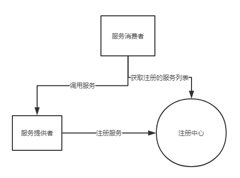

# SpringCloud学习

## 一、Euraka 知识

### 基础架构

​	服务注册中心： Eureka提供的注册中心，提供服务的注册于发现功能。

​	服务提供者： 提供服务的应用，Springboot功能将自己注册到注册中心上。

​	服务消费者：提供服务的消费，从注册中心上获取注册的服务，然后调用服务。

​	流程图：

​	

### 服务治理机制

#### 服务提供者

​	**服务注册：**服务提供者在启动的时候，会向注册中心发送一个rest请求，将自己注册到注册中心上去，同时请求包含了元数据信息。Eureka Server 接收到请求后会将服务保存到一个双层结构的Map中去。第一层的key是服务名，第二层的key是具体的服务名。确保**eureka.client.register-with-eureka=ture**，才会注册成功。

​	**服务同步：**当在注册中心集群时，注册中心相互之间注册，当有服务提供者请求时，它会请求转发到相连的注册中心上去，从而实现服务同步。

​	**服务续约：**注册完成后，服务提供者会发送心跳给注册中心，告知注册中心，避免会踢出服务列表。

​			  **eureka.instance.lease-renewal-interval-in-seconds=30**   服务续约调用间隔时间

​			  **eureka.instance.lease-expiration-duration-in-seconds=90** 服务失效时间

  **服务消费者**

​	**获取服务：** 服务消费者在启动时会向注册中心发送一个rest请求，来获取服务列表，为了性能考虑，列表刷新时间为		30秒

​	

